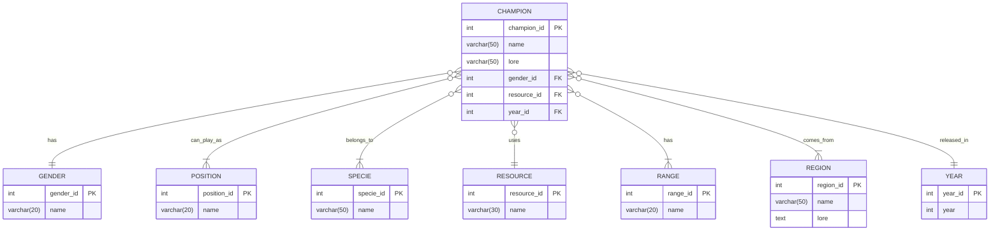

# TP SQL : Requêtes pour la base de données League of Legends

## Objectif
L'objectif de ce TP est de vous familiariser avec l'écriture de requêtes SQL, en utilisant le contexte de League of Branly. Vous pratiquerez la création et la modification de tables, ainsi que diverses opérations sur les données.

## Prérequis
- Connaissance de base du SQL
- Compréhension du MCD de League of Branly fourni ci-dessous

## Contexte
Vous travaillez sur une base de données SQLite qui gère les informations sur les champions de League of Branly. Pour visualiser la base de données et tester vos requêtes vous pouvez utiliser Heidi installé lors du TP précédent.

## Exercices
- Pour chaque exercice, écrivez la requête SQL pure.
- Commentez vos requêtes pour expliquer votre raisonnement.
- Assurez-vous que chaque requête est syntaxiquement correcte et optimisée.
- Pensez à l'utilisation appropriée des index pour améliorer les performances des requêtes.

### 1. Création d'une table
Créez une table `champions` avec les colonnes appropriées basées sur le MCD fourni.

### 2. Modification d'une table
Ajoutez une nouvelle colonne `popularity` de type INT à la table `champions`.

### 3. Insertion de données
Insérez le champion Fiddlesticks dans la table `champions` avec les attributs suivants :
- Nom : Fiddlesticks
- Titre : The Ancient Fear
- Genre : Autre
- Espèce : Démon
- Ressource : Mana
- Portée : À distance
- Région principale : Runeterra
- Année de sortie : 2009
- Popularité : 5 (sur une échelle de 1 à 10)

Assurez-vous d'insérer également les données nécessaires dans les tables pivots associées (comme `champion_specie` par exemple).

### 4. Récupération de tous les champions
Écrivez une requête SQL pour récupérer tous les champions, triés par nom.

### 5. Recherche de champions par nom
Implémentez une requête qui permet de trouver des champions dont le nom contient une chaîne spécifique.
On pourra tester avec la chaîne `ar`.

### 6. Modification d'un enregistrement
Mettez à jour la popularité des champions en leur attribuant une valeur aléatoire entre 1 et 10. Utilisez la fonction `RANDOM()` (`RAND()` sous MySQL et `RANDOM()` sous SQLite) pour générer cette valeur aléatoire. 

Note : `RANDOM()` genère un nombre entre -9223372036854775808 et +9223372036854775807.

### 7. Suppression d'un enregistrement
Supprimez un champion spécifique de la table.

### 8. Jointure avec les positions
Écrivez une requête qui récupère tous les champions avec leurs positions associées. Votre requête affichera deux colonnes :
* Le nom des champions
* La ou les noms des positions

### 9. Groupement par ressource
Créez une requête qui compte le nombre de champions pour chaque type de ressource. Votre requête affichera deux colonnes :
* Le nom des ressources
* Le nombre de champion ayant cette ressource

### 10. Champions par région
Implémentez une requête qui récupère tous les champions d'une région spécifique.

### 11. Champions multi-régions
Trouvez tous les champions qui sont associés à plus d'une région.

### 12. Requête complexe : Champions polyvalents
Écrivez une requête pour trouver les champions qui peuvent jouer à plus de 2 positions différentes.

## Bonus
- Écrivez une procédure stockée qui effectue une opération complexe sur la base de données.
- Créez une vue qui simplifie une requête complexe fréquemment utilisée.

## Rendu
À la fin du TP, vous devrez soumettre un fichier SQL contenant toutes vos requêtes, accompagnées de commentaires explicatifs. Assurez-vous que votre code est bien formaté et suit les bonnes pratiques SQL.
